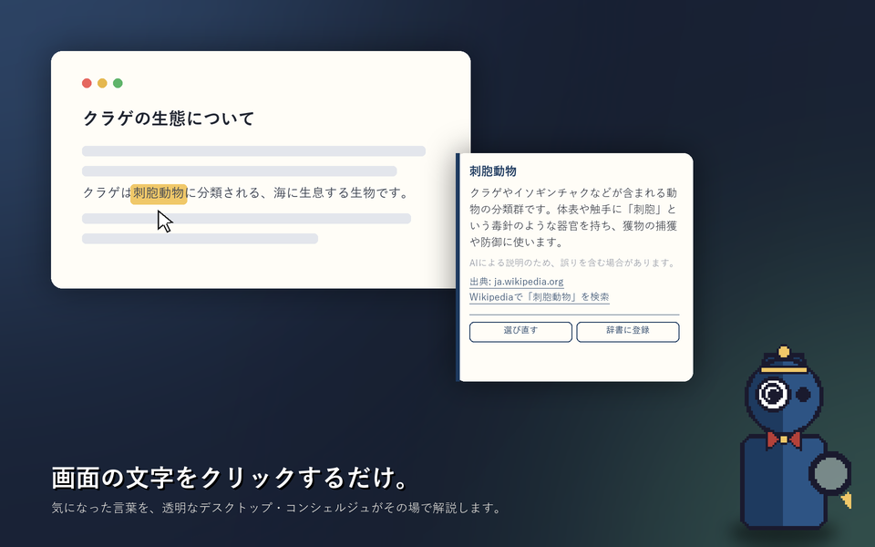
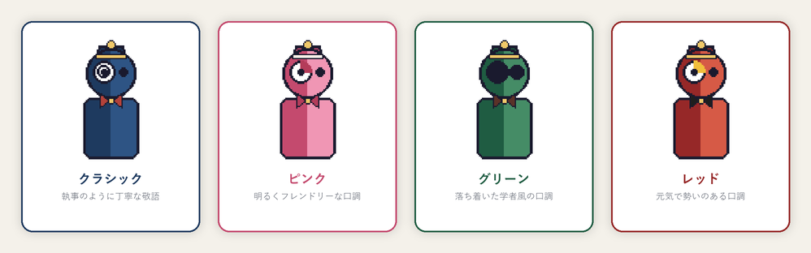

# concierge

透明・常時最前面のデスクトップ常駐コンシェルジュアプリ(Electron製)。画面上の気になった文字をクリック、またはマーカーでなぞるだけで、Gemini APIが簡潔に解説してくれます。




## 使い方

1. 初回起動時に設定ウィンドウが開くので、Gemini APIキーを入力してください(後述)。
2. 画面右下にベルボーイ姿のマスコットが常駐します。ふだんは緩やかに浮遊しながら、たまに少しだけ横に移動します。
3. マスコットのまわりの余白部分はドラッグして好きな位置に移動できます。
4. マスコット本体を**クリック**すると「調べるモード」に入り、虫眼鏡を持ったポーズに変わってカーソルが十字になります。
5. 調べたい文字の上で**クリック**すると、その位置に一番近い単語をOCRで読み取ります。複合語や熟語など、正確に範囲を指定したいときはマーカーで**なぞって(ドラッグして)**ハイライトすると、その範囲を丸ごと読み取ります。結果はクリック位置の近くに吹き出しで表示され、1回調べると「調べるモード」は自動的に終了します。
6. 違う文字を選んでしまった場合は、吹き出しの「この語句じゃない?選び直す」ボタンで調べるモードに戻り、選び直せます。
7. 「辞書に登録」ボタンを押すと、その語句と説明をローカルの辞書に保存できます(登録するかどうかは毎回自由に選べます)。保存した内容は、マスコットを右クリック→「辞書を見る」から確認・削除できます。
8. 「調べるモード」は `Esc` キーでも終了できます。

## マスコットの見た目・口調

右クリック(またはタスクトレイのアイコンを右クリック)のメニュー「見た目を変える」から4種類のキャラクターに切り替えられます。それぞれ解説の口調も変わります。

| キャラクター | 口調 |
| --- | --- |
| クラシック(紺) | 執事のように丁寧な敬語 |
| ピンク | 明るく親しみやすいフレンドリーな口調 |
| グリーン(眼鏡) | 落ち着いた学者風の口調 |
| レッド | 元気で勢いのある口調 |



タスクトレイのアイコンをクリックすると、マスコットをクリックしたときと同じように調べるモードを開始/終了できます。右クリックでメニュー(見た目の変更・辞書・システム情報・APIキー再設定・終了)を開けます。

> AIによる説明のため、誤りを含む場合があります。断定を避ける言い回しや「情報が不十分で断定できません」という回答が出ることがありますが、これはハルシネーション対策としての意図的な挙動です。

## コード解説・コード図鑑

右クリックメニューの「コードを解説する」から、コードファイル(JavaScript / TypeScript / Python / C)をドラッグ&ドロップすると、

- ファイル全体が何をしているか、使われているライブラリ、口調に合わせたAI解説を表示
- コード中の関数・クラス名の横に💬ボタンが付き、クリックするとその項目だけの解説が吹き出しで表示
- 検出した文法要素(関数・ループ・条件分岐・例外処理など)やライブラリ(React・pandasなど)を自動でカウント

されます。「コード図鑑を見る」から、これまでに検出した文法要素・ライブラリを図鑑形式(Pokédex風)で一覧できます。検出したことのない項目はシルエット表示になり、コードを解析するたびに発見・カウントが増えていきます。

React・pandas・NumPy・Expressの4つは、ライブラリ名だけでなく実際に使っている個々の関数/フック/メソッド(例: React なら `useState`・`useEffect`・`Suspense` など)まで図鑑として分けて集計します。それぞれ専用のセクションになっていて、検索するとヒットしたセクションだけが進捗バー付きで表示されるので、どのライブラリのどの項目を見つけたかが一目で分かります。それ以外のライブラリは「その他ライブラリ」としてまとめて表示されます。

> 文法要素の検出は簡易的なパターンマッチングによるもので、正確な構文解析ではありません。件数はあくまで目安です。

## ダウンロード

Node.jsのインストールやコマンド操作なしで使いたい場合は、[Releases](https://github.com/yooogeee16/concierge/releases) ページから `Concierge Setup x.x.x.exe` をダウンロードして実行してください(現時点ではWindows向けのみ配布しています)。

> 署名なしビルドのため、初回起動時に「発行元を確認できません」等の警告が出ることがあります。「詳細情報」→「実行」で起動できます。

## 開発者向け: ソースから実行

- [Node.js](https://nodejs.org/) 18以降 / npm

```bash
npm install
```

```bash
npm start
```

初回起動時に設定ウィンドウが開きます。[Google AI Studio](https://aistudio.google.com/apikey) で無料枠のAPIキーを発行し、貼り付けて保存してください。キーはこの端末内(`%APPDATA%/concierge/settings.json`)にのみ保存され、リポジトリやクラウドには一切含まれません。後からいつでもマスコット右クリック(またはトレイアイコン右クリック)→「APIキーを再設定」で変更できます。

「後で設定する」を選んだ場合もアプリ自体は起動しますが、調べるモードでは「APIキーが設定されていません」というエラーになります。

初回、調べるモードで最初にクリックしたとき、OCRエンジン(Tesseract.js)が日本語・英語の言語データをダウンロードします(数MB、初回のみ、インターネット接続が必要)。

## 動作の仕組み

1. マスコットクリックで「調べるモード」に入ると、画面全体を覆う透明な(見た目には何も描画されない)ウィンドウを重ねてクリック位置を検出します。
2. クリックされた地点の周辺(既定 480×140px)をスクリーンショットとして取得します(`desktopCapturer`)。
3. 取得した画像をTesseract.js(OCR)でテキスト認識し、クリック位置に最も近い単語とその行のテキストを抽出します。
4. 抽出した語句と周辺文脈、選択中キャラクターの口調指定をGemini API(既定 `gemini-3.1-flash-lite`)に渡し、100〜150文字程度の簡潔な説明を取得します。Google検索グラウンディングが利用できる場合は実際の検索結果に基づいた根拠も取得します(無料枠キーではグラウンディングが429になることがあるため、その場合は自動的に通常の生成にフォールバックします)。
5. 結果を吹き出しウィンドウに表示します。

## ハルシネーション対策

- プロンプトで「確実に分かっている事実のみを述べる」「確信が持てない場合は断定しない・正直に不明と答える」ことを明示的に指示しています。
- 利用可能な場合はGemini APIのGoogle検索グラウンディング機能を使い、実際の検索結果に基づいた根拠(参照元リンク)を取得します。
- 参照元リンクは常にWikipedia検索へのリンクも併記します(こちらはAIの生成物ではなく、語句から機械的に組み立てた確実なURLです)。
- 吹き出しには常に注意書き(キャラクターの口調に合わせた文面)を表示します。
- OCRで誤った語句を拾ってしまった場合に備え、いつでも「選び直す」ボタンで再度クリックし直せます。

## プロジェクト構成

```
concierge/
├── main.js                    # メインプロセス(ウィンドウ管理・IPC・OCR/API呼び出しの司令塔)
├── preload-mascot.js           # マスコットウィンドウ用preload
├── preload-overlay.js           # 調べるモードのクリック検出用ウィンドウのpreload
├── preload-popup.js             # 解説吹き出しウィンドウのpreload
├── preload-setup.js              # 初期設定ウィンドウのpreload
├── preload-dictionary.js          # 辞書ウィンドウのpreload
├── preload-code.js                 # コード解説ウィンドウのpreload
├── preload-codedex.js               # コード図鑑ウィンドウのpreload
├── src/
│   ├── store.js                 # 設定(APIキー・キャラクター等)の読み書き(userData配下)
│   ├── dictionary.js             # 辞書データの読み書き(userData配下)
│   ├── personas.js                # キャラクターごとの口調・アクセントカラー定義
│   ├── screenshot.js               # クリック位置周辺のスクリーンショット取得・切り出し
│   ├── ocr.js                       # Tesseract.jsによるOCR、最寄りの単語抽出
│   ├── gemini.js                     # Gemini APIへの問い合わせ・グラウンディング情報の抽出
│   ├── sysinfo.js                     # CPU/メモリ/ストレージ/ネットワークの状況取得(右クリックメニュー用)
│   ├── codeCatalog.js                  # コード図鑑の静的カタログ(文法要素・ライブラリの定義)
│   ├── codeLibraryObjects.js            # React/pandas/NumPy/Expressの詳細なAPI図鑑と検出パターン
│   ├── codeAnalyzer.js                  # コードのパターンマッチング解析(言語判定・構文/ライブラリ検出)
│   └── codedex.js                        # 図鑑カウントの読み書き(userData配下)
├── scripts/
│   └── gen_mascot.py                  # マスコットのドット絵(SVG)・トレイアイコン生成スクリプト(PIL使用)
└── renderer/
    ├── assets/                         # マスコットのSVG・トレイアイコン(4キャラクター分)
    ├── mascot/                          # マスコットウィンドウ
    ├── overlay/                          # 調べるモード中の全画面クリック検出ウィンドウ
    ├── popup/                             # 解説吹き出しウィンドウ
    ├── setup/                              # 初期設定ウィンドウ
    ├── dictionary/                          # 辞書ウィンドウ
    ├── code/                                 # コード解説ウィンドウ
    └── codedex/                               # コード図鑑ウィンドウ
```

## 既知の制限

- 画面上の文字認識はOCR方式のため、画像化された文字・崩れたフォント・背景とのコントラストが低い文字などは認識精度が落ちる場合があります。
- 現状は単一ディスプレイ(カーソルがあるディスプレイ)のスクリーンショット取得を前提にしています。
- システム情報のGPU使用率・温度は環境依存で信頼性が低いため対応していません。
- Windows向けに開発・動作確認しています。

## ライセンス

[MIT License](./LICENSE)
